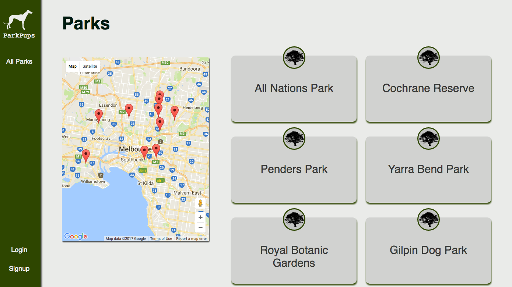

# ParkPups

ParkPups is a Rails app that is kind of like Facebook for dogs. It tracks which dog park you walk your dog at and when, so you can sync up with all the other dogs your dog is used to seeing at the park. By design, it contains no human-to-human social networking, to prevent it devolving into a 'normal' social network (like Tindog), which began as "Tindr for dogs" but eventually became "Tindr for dog-lovers".

## Usage

ParkPups is currently deployed via Heroku to parkpups.net

## Technology

ParkPups uses the Google Maps API with vanilla Javascript and jQuery on the frontend, and Rails with Postgres on the backend.
